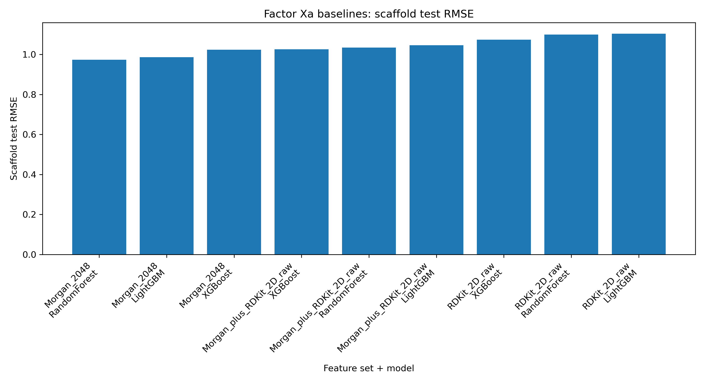
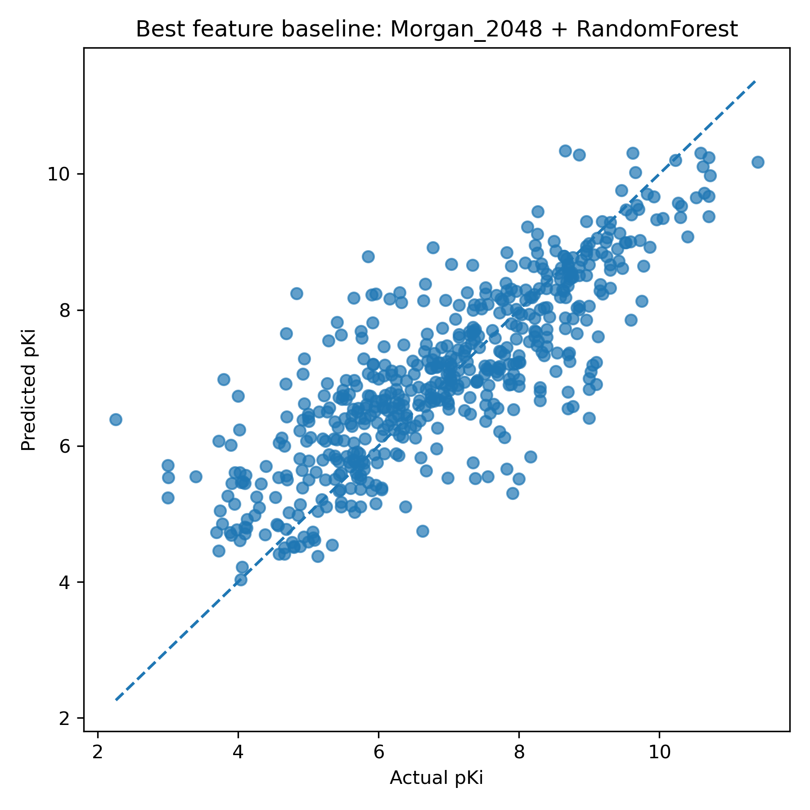
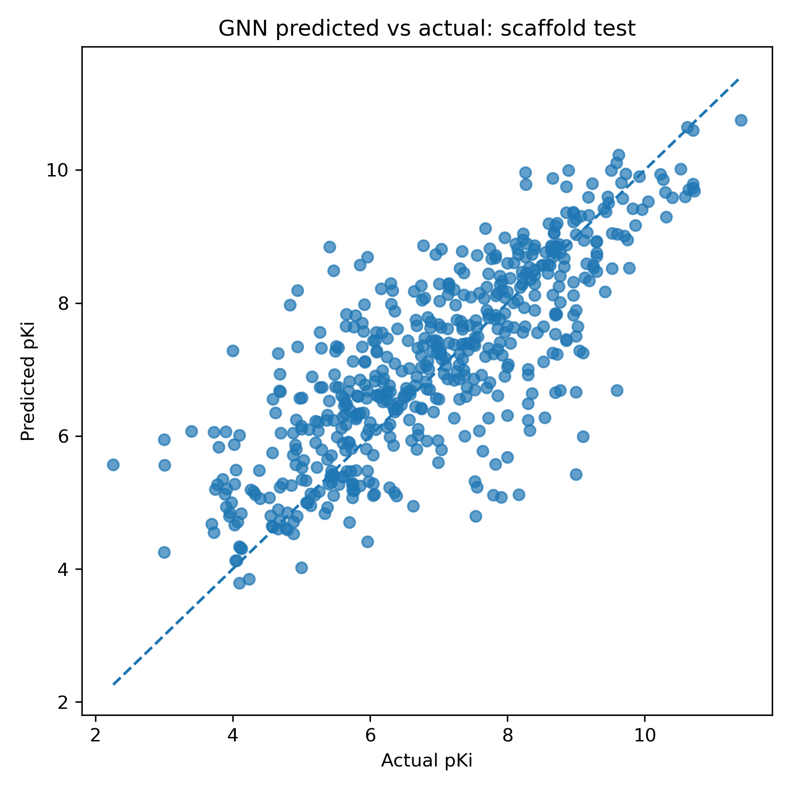
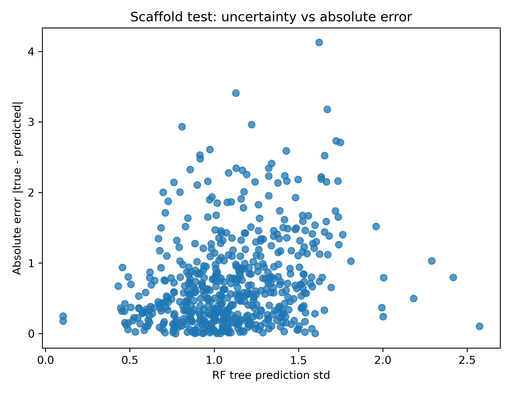
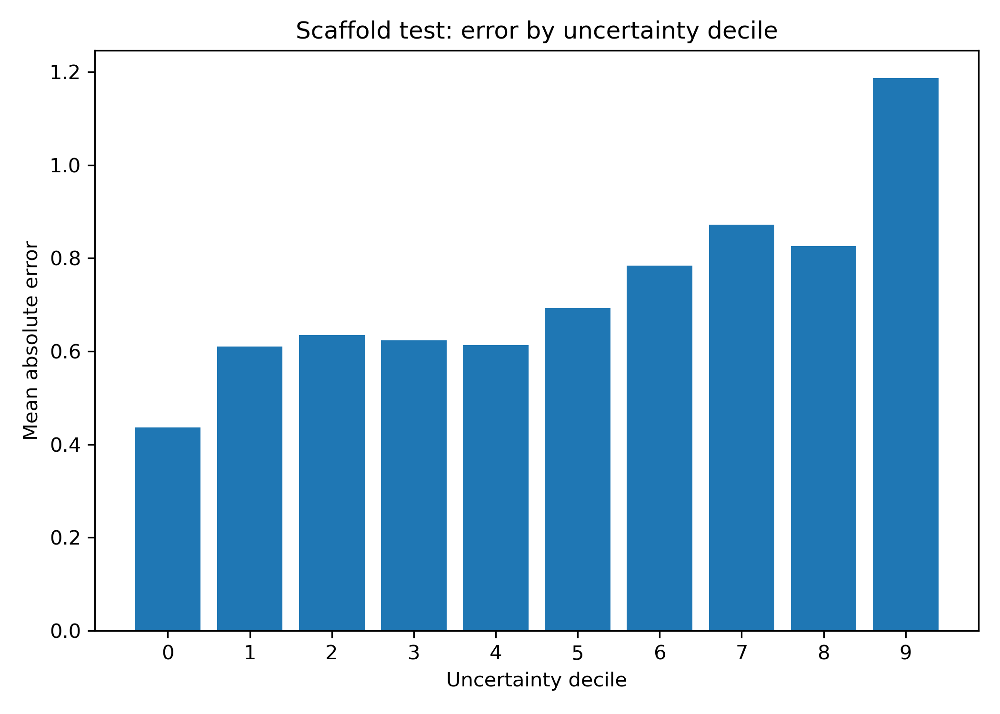
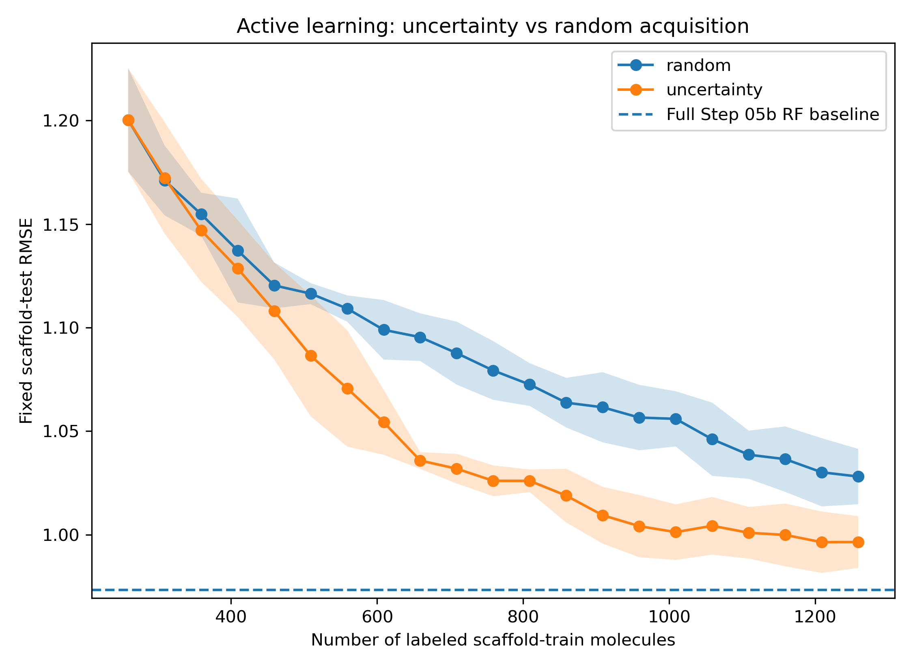
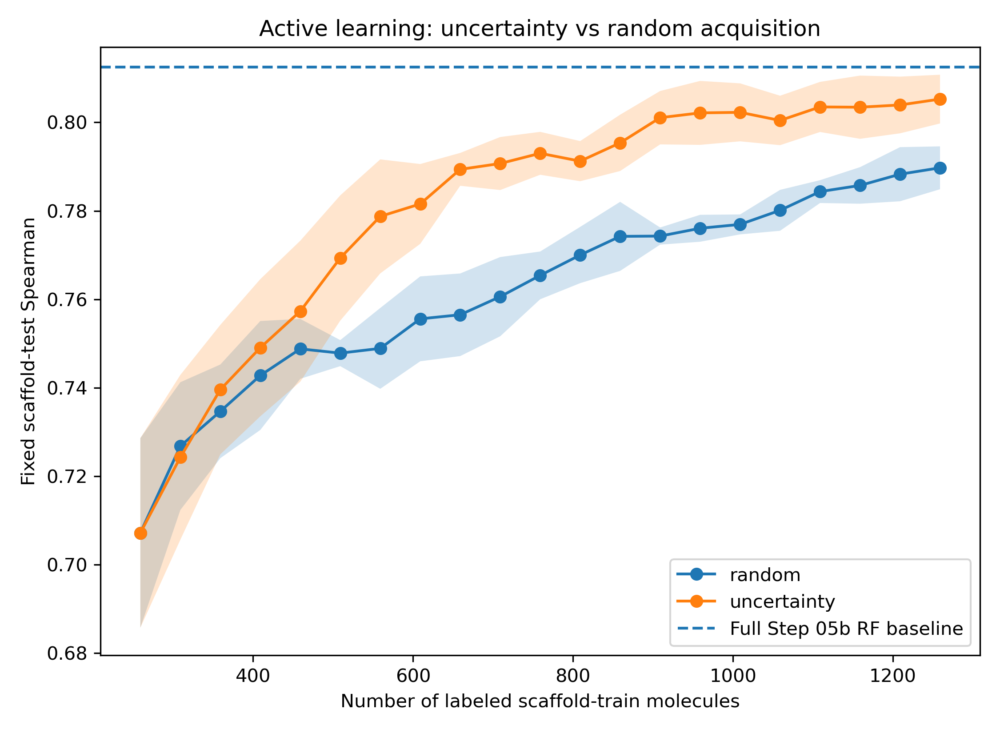

# QSAR and Graph Neural Network Modeling for Factor Xa Activity Prediction

**Repository:** `Factor-Xa-QSAR-GNN-Activity-Prediction`

**GitHub description:** Scaffold-aware Factor Xa pKi prediction with ML baselines, graph neural networks, uncertainty estimation, and active-learning prioritization.

---

## Project Overview

This repository contains a reproducible molecular machine-learning workflow for predicting **Factor Xa (FXa / coagulation Factor X)** inhibitor potency from chemical structure.

The project uses curated public ChEMBL bioactivity data for **Factor Xa target CHEMBL244** and models **pKi only** as the final regression endpoint. The workflow compares classical molecular machine-learning baselines, RDKit descriptor models, combined feature models, and a PyTorch Geometric graph neural network under fixed scaffold-aware evaluation.

The final selected model was a **Morgan fingerprint Random Forest**, which provided the strongest scaffold-test generalization among the tested feature/model combinations. A GINE graph neural network learned meaningful structure-activity signal but did not outperform the classical Morgan Random Forest baseline on this dataset.

The project also evaluates Random Forest tree-ensemble disagreement as a practical uncertainty proxy and tests its utility in a retrospective active-learning simulation.

---

## Why This Project Matters

Molecular machine-learning models often look strong under random splits but perform less well when evaluated on new chemical scaffolds. This project emphasizes realistic model assessment by using scaffold-aware splits, strong baseline comparisons, uncertainty analysis, and active-learning simulation.

The project demonstrates:

- endpoint-disciplined ChEMBL curation
- scaffold-aware train/validation/test splitting
- descriptor and fingerprint baseline benchmarking
- graph neural network benchmarking
- uncertainty-error analysis
- retrospective active-learning prioritization
- transparent limitations and reproducible outputs

---

## Dataset Summary

| Item | Value |
|---|---|
| Target | Factor Xa / Coagulation Factor X |
| ChEMBL target ID | CHEMBL244 |
| Modeled endpoint | pKi only |
| Final curated molecules | 3,695 |
| Molecular representation | Standardized SMILES |
| Primary evaluation | Scaffold split |
| Canonical model | Morgan_2048 + RandomForest |

Only pKi values were modeled. Ki, IC50, and other endpoint types were not combined in the final regression target. This avoids endpoint mixing and makes the regression task more chemically interpretable.

---

## Scaffold Split

| Split | Molecules | Purpose |
|---|---:|---|
| Scaffold train | 2,586 | Model fitting and active-learning acquisition pool |
| Scaffold validation | 554 | Model selection and hyperparameter decisions |
| Scaffold test | 555 | Final headline evaluation on held-out scaffolds |

Scaffold-test performance is used as the main evaluation because random splits can overestimate model performance when close analogs appear in both training and test sets.

---

## Workflow

| Step | Script | Purpose |
|---:|---|---|
| 01 | `01_pull_fxa_chembl_raw.py` | Download raw Factor Xa ChEMBL bioactivity data |
| 02 | `02_compare_fxa_endpoints.py` | Compare endpoint availability and select endpoint strategy |
| 03 | `03_curate_fxa_dataset.py` | Curate the final pKi regression dataset |
| 04 | `04_make_features_and_splits.py` | Generate Morgan fingerprints and fixed scaffold/random splits |
| 05 | `05_train_baselines_morgan.py` | Train Morgan fingerprint RF/XGBoost/LightGBM baselines |
| 05b | `05b_benchmark_morgan_rdkit2d_combined_features.py` | Benchmark Morgan, RDKit 2D, and combined feature sets |
| 06 | `06_train_gnn_fxa.py` | Train the PyTorch Geometric GINE graph neural network |
| 07 | `07_uncertainty_error_analysis.py` | Analyze RF uncertainty versus prediction error |
| 08 | `08_active_learning_uncertainty_vs_random.py` | Run retrospective active-learning simulation |

All model comparisons use the same saved splits to avoid split drift between experiments.

---

## Feature Sets and Models

| Category | Methods |
|---|---|
| Molecular representations | Morgan_2048 fingerprints, RDKit_2D_raw descriptors, Morgan_plus_RDKit_2D_raw combined features |
| Classical ML models | Random Forest, XGBoost, LightGBM |
| Graph neural network | PyTorch Geometric GINE model with atom and bond categorical embeddings |
| Preprocessing control | Descriptor imputation and zero-variance filtering fit only on the training split |

---

## Key Results

### 1. Canonical scaffold-test model

| Feature set | Model | RMSE | MAE | R² | Spearman |
|---|---|---:|---:|---:|---:|
| Morgan_2048 | RandomForest | 0.973 | 0.728 | 0.661 | 0.813 |

The Morgan fingerprint Random Forest was selected as the canonical downstream model because it provided the strongest scaffold-test generalization among the tested feature/model combinations. Full per-feature-set and per-model numbers are reported in the technical report.

### 2. GNN benchmark

| Model | Representation | RMSE | MAE | R² | Spearman |
|---|---|---:|---:|---:|---:|
| RandomForest | Morgan_2048 | 0.973 | 0.728 | 0.661 | 0.813 |
| GINE GNN | Molecular graph | 1.056 | 0.790 | 0.601 | 0.775 |

The GINE graph neural network learned meaningful structure-activity signal, but it did not outperform the Morgan Random Forest baseline. This result highlights the importance of strong classical baselines in molecular machine learning.

### 3. Uncertainty analysis

| Metric | Value |
|---|---:|
| Spearman correlation between RF uncertainty and absolute error | 0.275 |
| p-value | 4.1e-11 |
| Top 5% uncertainty enrichment for high-error molecules | 2.7x |

Random Forest tree-level prediction standard deviation was used as an ensemble-disagreement score, not as a calibrated Bayesian uncertainty estimate. The positive relationship with absolute error supports its use as a practical flag for molecules requiring expert review or additional labeling.

### 4. Active-learning simulation

| Acquisition strategy | Final labeled molecules | Test RMSE | Test MAE | Test Spearman |
|---|---:|---:|---:|---:|
| Random | 1,259 | 1.028 | 0.775 | 0.790 |
| Uncertainty | 1,259 | 0.996 | 0.753 | 0.805 |

At the same labeling budget, uncertainty sampling reduced final RMSE by 0.032 pKi, reduced MAE by 0.022 pKi, and improved Spearman correlation by ~0.015. The gain was modest but useful because it connects uncertainty estimation to practical compound acquisition decisions.

---

## Recommended Figures

The following figures are recommended for GitHub or manuscript display when available in `results/figures/`:















If any figure file is not included in the public repository, remove or comment out the corresponding image link before release.

---

## Reproducibility

Dependencies are pinned in both `environment.yml` (conda) and `requirements.txt` (pip); use whichever matches your setup.

Run the workflow from the project root in the following order:

```powershell
python .\scripts\01_pull_fxa_chembl_raw.py *> .\scripts\01.log
python .\scripts\02_compare_fxa_endpoints.py *> .\scripts\02.log
python .\scripts\03_curate_fxa_dataset.py *> .\scripts\03.log
python .\scripts\04_make_features_and_splits.py *> .\scripts\04.log
python .\scripts\05_train_baselines_morgan.py *> .\scripts\05.log
python .\scripts\05b_benchmark_morgan_rdkit2d_combined_features.py *> .\scripts\05b.log
python .\scripts\06_train_gnn_fxa.py *> .\scripts\06.log
python .\scripts\07_uncertainty_error_analysis.py *> .\scripts\07.log
python .\scripts\08_active_learning_uncertainty_vs_random.py *> .\scripts\08.log
```

Commands are shown for PowerShell. On macOS/Linux, adapt the path separators and redirect syntax, for example:

```bash
python scripts/01_pull_fxa_chembl_raw.py > scripts/01.log 2>&1
```

Main output folders:

| Folder | Contents |
|---|---|
| `results/metrics/` | JSON summaries and run-level metrics |
| `results/tables/` | Curated datasets, model summaries, and active-learning tables |
| `results/figures/` | Prediction plots, benchmark plots, uncertainty plots, and active-learning curves |
| `models/` | Saved model artifacts, if included or released separately |

---

## Repository Structure

```text
Factor-Xa-QSAR-GNN-Activity-Prediction/
│
├── README.md
├── LICENSE
├── .gitignore
├── environment.yml
├── requirements.txt
├── data/
│   ├── processed/        # curated pKi modeling dataset and curation audit tables
│   ├── features/         # precomputed feature arrays (regenerable via scripts 04/05b)
│   └── splits/           # fixed scaffold/random split indices
├── src/
│   ├── featurize.py
│   ├── filters.py
│   └── metrics.py
├── scripts/
├── results/
│   ├── metrics/
│   ├── tables/
│   └── figures/
├── docs/
│   └── FXa_QSAR_GNN_Professional_Project_Summary.pdf
└── models/                # canonical model committed; full set released separately
```

---

## Full Technical Report

A detailed project summary is available in the `docs/` folder:

```text
docs/FXa_QSAR_GNN_Professional_Project_Summary.pdf
```

---

## Main Findings

1. Morgan fingerprints were the strongest molecular representation among the tested feature sets; the complete per-feature-set comparison is reported in the technical report.
2. Morgan_2048 + RandomForest was the best scaffold-selected model, with scaffold-test RMSE = 0.973 and Spearman = 0.813.
3. Random-split performance was higher than scaffold-split performance, confirming that random splits can overestimate generalization in molecular datasets; the random-split metrics are reported in the technical report.
4. The GINE graph neural network learned useful signal but did not outperform the classical Morgan Random Forest baseline.
5. Random Forest ensemble disagreement provided useful uncertainty information and improved label efficiency in a retrospective active-learning simulation.

---

## Limitations

1. Public ChEMBL assay data can contain assay heterogeneity even after endpoint filtering.
2. Only pKi values were modeled to reduce endpoint mixing; experimental conditions may still vary across assays.
3. Scaffold splitting is stricter than random splitting but remains a retrospective approximation of prospective medicinal chemistry deployment.
4. Random Forest tree standard deviation is an uncertainty proxy, not a fully calibrated uncertainty model.
5. The active-learning experiment is retrospective and should ideally be validated prospectively with newly acquired experimental data.
6. The GNN was used as a benchmark, but extensive architecture tuning was not the main focus because the tested model did not outperform the classical baseline.

---

## Data and Software Attribution

Bioactivity data were obtained from ChEMBL at EMBL-EBI. Users should cite ChEMBL and comply with ChEMBL data-use requirements.

This workflow uses open-source scientific Python and cheminformatics tools, including RDKit, scikit-learn, PyTorch, PyTorch Geometric, XGBoost, LightGBM, and related dependencies.

---

## Author

**Elumalai Pavadai**  
Computational chemistry / cheminformatics scientist with experience in QSAR/ML, graph neural networks, generative modeling, structure-based virtual screening, molecular modeling, and molecular dynamics.

---

## Citation

If this project is used or adapted, please cite the repository and the underlying data/software resources, including ChEMBL, RDKit, scikit-learn, PyTorch, PyTorch Geometric, XGBoost, and LightGBM.

---

## Project Status

This repository is suitable for professional portfolio use after final public-release cleanup and verification. The results are computational and should not be interpreted as experimentally validated Factor Xa inhibition.
